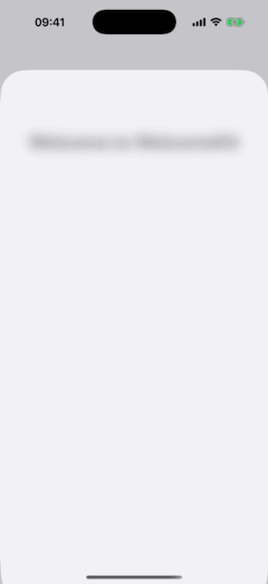
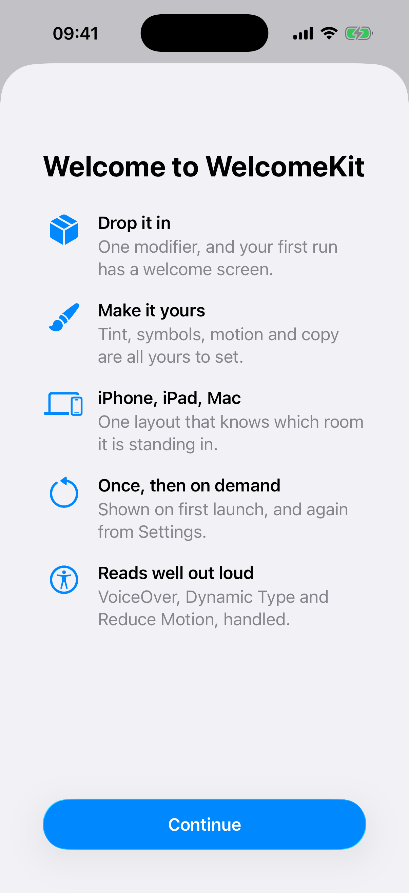
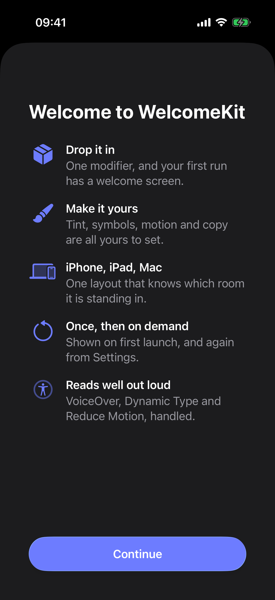
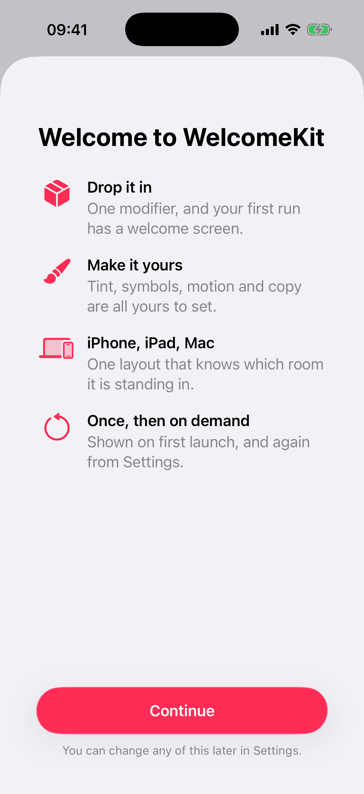
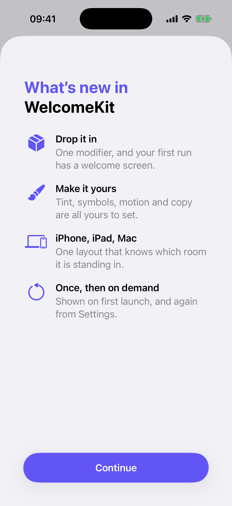
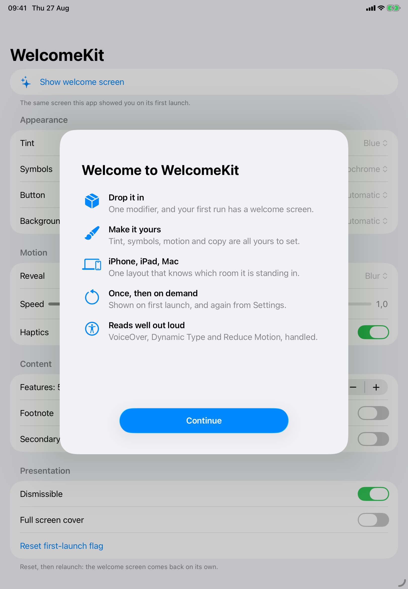
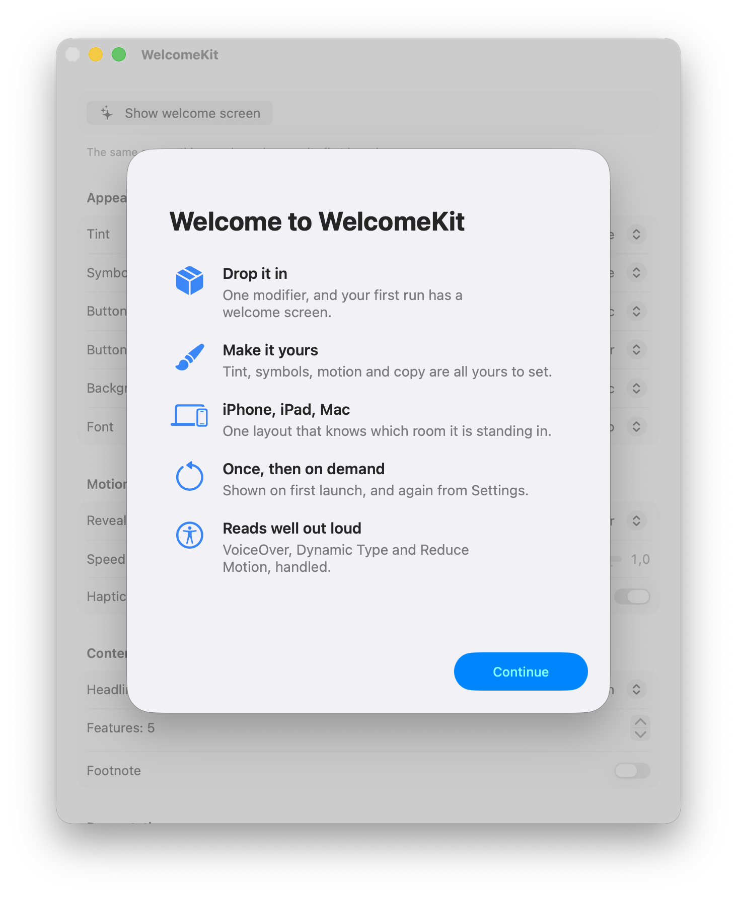
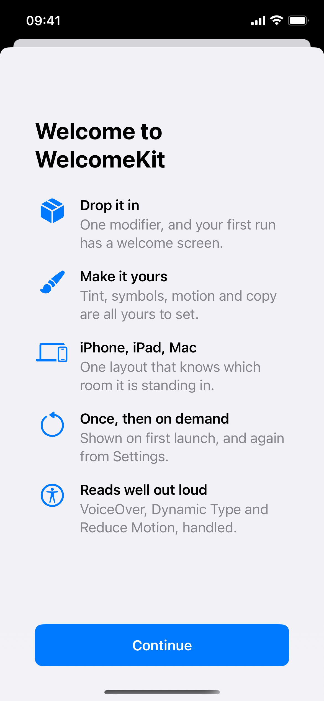

# WelcomeKit

[](https://github.com/louisauguste/WelcomeKit/actions/workflows/ci.yml)

The "Welcome to…" screen Apple opens its own apps with, as a Swift package. A big
title, a list of features with SF Symbols beside them, a button pinned to the
bottom. Then a reveal that assembles the whole thing one row at a time.

<p align="center">
  
</p>

Two lines to show it on first launch. One more to bring it back from Settings.

<p align="center">
  
  
  
</p>

## Install

Xcode → File → Add Package Dependencies, then paste the repository URL. Or in a
`Package.swift`:

```swift
.package(url: "https://github.com/louisauguste/WelcomeKit.git", from: "1.3.0")
```

## Use it

### On first launch

```swift
import WelcomeKit

ContentView()
    .welcomeSheetOnFirstLaunch(
        title: "Welcome to Ova",
        features: [
            WelcomeFeature("Private by design",
                           subtitle: "Everything runs on your device.",
                           systemImage: "lock.fill"),
            WelcomeFeature("Every model",
                           subtitle: "Local and cloud, in one place.",
                           systemImage: "square.stack.3d.up.fill"),
            WelcomeFeature("Yours to shape",
                           subtitle: "Agents, prompts, shortcuts.",
                           systemImage: "wrench.and.screwdriver.fill")
        ]
    )
```

Shown once, then never again. The flag lives in `UserDefaults`.

### Again, from Settings

```swift
@State private var showWelcome = false

Button("Welcome screen") { showWelcome = true }
    .welcomeSheet(
        isPresented: $showWelcome,
        title: "Welcome to Ova",
        features: features,
        presentation: .dismissible   // swiping it away is fine this time
    )
```

Same screen, same animation, no flag touched.

### Or present it yourself

```swift
WelcomeView(headline: "Welcome to Ova", features: features) {
    dismiss()
}
```

### Two headlines

A first run gets one line. An update gets the two-tone headline Apple uses — a
lead line in your accent colour, the app's own name underneath:

```swift
WelcomeView(headline: .whatsNew(in: "Ova"), features: changes) { dismiss() }
WelcomeView(headline: .welcome(to: "Ova"), features: features) { dismiss() }
WelcomeView(headline: "Welcome to Ova", features: features) { dismiss() }
```

<p align="center">
  
</p>

Both lead lines are localized keys, so an app that already translates
"Welcome to" gets it for nothing, and `.twoTone(lead:name:)` takes your own
wording. The whole headline renders as a single `Text`: it wraps, it scales with
Dynamic Type, and VoiceOver reads it in one go rather than as two stacked views.

## Make it yours

Everything hangs off one struct. Set what you care about, leave the rest.

```swift
var configuration = WelcomeConfiguration.default
configuration.accentColor = .pink
configuration.symbolRenderingMode = .hierarchical
configuration.animation = .speed(1.4)
configuration.continueTitle = "Let's go"
configuration.footnote = "You can change this later in Settings."
```

| | |
|---|---|
| `accentColor` | Tint for the symbols and the button. `nil` inherits the app's own `.tint(_:)`. |
| `symbolRenderingMode` | `.monochrome`, `.hierarchical`, `.palette`, `.multicolor`, with `symbolPalette` for the palette layers. |
| `symbolSize`, `symbolWeight` | 28pt regular on iOS, 27pt on macOS, until you say otherwise. |
| `animation` | `.default`, `.disabled`, `.speed(1.5)`, or a `WelcomeAnimation` with your own delays. |
| `animation.style` | `.blur` (the reference), `.slide`, `.fade`, `.scale`, `.none`. |
| `isHapticsEnabled` | A tap per row, a success note when the button lands. iOS only. |
| `background` | `.automatic`, `.color(_:)`, `.gradient(_:)`, `.clear`. |
| `buttonStyle` | `.automatic`, `.prominent`, `.glass`, `.bordered`. |
| `macOSActionPlacement` | macOS only: `.trailing` (default) anchors a compact button to the window's bottom-trailing corner, `.fullWidth` keeps the centred bar every other platform uses. |
| `continueTitle`, `footnote` | The copy. Localized keys by default. |
| `maximumFeatureCount` | Show the first N rows of a longer list. |
| `fontDesign` | `.default` (SF Pro), `.rounded`, `.serif` (New York), `.monospaced`. Applies to every font the package picks for itself. |
| `titleFont`, `featureTitleFont`, `featureSubtitleFont`, `buttonFont` | Fonts, if the defaults are not your defaults. A font you pass wins outright, `fontDesign` included. |
| `metrics` | Every padding, width and breakpoint in the layout. |
| `localizationBundle`, `localizationTable` | Where the keys are looked up. |

Rows can overrule the configuration one at a time:

```swift
WelcomeFeature("Pro", subtitle: "Every model, no limits.",
               systemImage: "sparkles",
               tint: .orange,
               symbolRenderingMode: .palette,
               symbolPalette: [.orange, .yellow])
```

## One layout, three shapes

<p align="center">
  
  
</p>

**iPhone** gets the layout the design was drawn for: 42pt text margins, notch-sized
headroom, and a full-bleed button inset 40pt on all three sides, so the gap under
it matches the gap to its left and right.

**iPad** measures the surface it landed on. Past 500pt the button stops growing
at 320pt and centres, the text column widens to 520pt with tighter margins, and
the top padding drops, because a sheet has no notch to clear. The check is a
measured width *and* the iPad idiom, so an iPhone in landscape and an iPad in
Slide Over both keep the phone numbers.

**Mac** takes a 480×560 sheet with a 26pt title and 27pt symbols, sets its label
in 15pt medium instead of the smaller, heavier `.headline` a Mac resolves that
to, and by default anchors a compact button to the window's bottom-trailing
corner — the same grammar as Setup Assistant and Migration Assistant — rather
than the full-width bar every other platform uses. Set `macOSActionPlacement`
to `.fullWidth` to keep the centred bar, capped at 300pt, instead.

## What it handles for you

- **Reduce Motion** skips the reveal and shows the finished screen, unless you
  turn that off.
- **VoiceOver** reads the title as a header and skips rows that haven't arrived
  yet, so nothing gets announced twice.
- **Dynamic Type** works throughout, and the title shrinks rather than wrapping
  past two lines.
- **Liquid Glass** on iOS 26 and macOS 26. Below that the button falls back to a
  bordered prominent one and the bottom bar to a `safeAreaInset` with a gradient,
  so nothing looks broken on iOS 17 or 18.

<p align="center">
  
</p>

## Coming back later

The first-launch flag is a `UserDefaults` bool you can reach:

```swift
WelcomeStore.hasSeenWelcome()          // did they see it?
WelcomeStore.markAsSeen()              // they have, elsewhere, so skip it
WelcomeStore.reset()                   // show it again on next launch
WelcomeStore.key(for: "welcome")       // "WelcomeKit.hasSeen.welcome"
```

Give a second screen its own `id` and it keeps its own flag, which is enough for
a "what's new in 2.0" sheet:

```swift
.welcomeSheetOnFirstLaunch(
    id: "whats-new-2.0",
    headline: .whatsNew(in: "Ova"),
    features: changes
)
```

## Demo

`Demo/WelcomeKitDemo.xcodeproj` builds for iPhone, iPad and Mac. Every knob above
is a control in it, so you can see what a setting does before you write it down.

## Requirements

iOS 17, iPadOS 17, macOS 14. Swift 6, Xcode 16 or later. No dependencies.

visionOS builds from the same source and is declared in the manifest, but I don't
have a headset to check it on. Treat it as untested.

## Where it comes from

This was the onboarding screen of an app I ship. It was three files, hard-wired
to one app's colours and copy, with the iPad numbers discovered the slow way.
Pulling it out was mostly deciding what deserved to be a parameter. Then I added
the knobs I'd kept wishing for.

## License

MIT. See [LICENSE](LICENSE).
